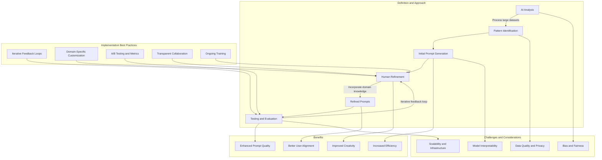

# Collaborative AI in Prompt Engineering

A comprehensive guide to understanding and implementing the synergy between human expertise and AI systems for effective prompt engineering.

---

## Table of Contents

- [Definition and Approach](#definition-and-approach)
- [Benefits](#benefits)
- [Challenges-and-Considerations](#challenges-and-considerations)
- [Implementation-Best-Practices](#implementation-best-practices)
- [Conclusion](#conclusion)

---

## Definition and Approach

Collaborative AI in prompt engineering is a process that merges the computational power of AI with the nuanced insights of human experts. In this approach, AI systems are used to analyze large datasets, identify recurring patterns, and generate initial prompt suggestions. Human prompt engineers then refine these suggestions by incorporating domain-specific knowledge, context, and desired objectives.

Key elements include:

- **Data-Driven Generation**: AI algorithms process vast amounts of text data to identify effective prompt structures and linguistic patterns.
- **Human Refinement**: Experts review AI-generated prompts to ensure clarity, cultural sensitivity, and alignment with specific use cases.
- **Iterative Feedback**: A continuous loop where outputs are tested, evaluated, and refined, enhancing overall performance and accuracy.

This partnership enables organizations to rapidly develop high-quality prompts that are both data-informed and contextually relevant.

---

## Benefits

Collaborative AI in prompt engineering offers several tangible benefits:

1. **Enhanced Prompt Quality**  
   - **Data-Driven Insights**: AI tools identify effective linguistic patterns and potential ambiguities, providing a solid foundation for prompt creation.
   - **Human Oversight**: Expert review ensures that prompts are refined to accurately convey intended meaning and cater to target audiences.
   - **Example**: In content generation, AI may suggest several prompt variants which human experts adjust for tone and relevance, leading to more engaging outputs.

2. **Increased Efficiency**  
   - **Automation of Repetitive Tasks**: AI automates the initial generation of prompts, allowing engineers to focus on refinement and testing.
   - **Faster Iterations**: With less time spent on drafting, prompt sets can be updated quickly to reflect new data or changing user needs.
   - **Example**: In customer support, pre-generated prompt templates can be quickly tailored to address evolving queries, reducing response times.

3. **Improved Creativity and Innovation**  
   - **Freeing Human Resources**: With routine tasks automated, prompt engineers can experiment with novel approaches and creative structures.
   - **Innovative Applications**: This creative freedom often leads to the development of unique prompts that better capture complex ideas.
   - **Example**: In marketing, innovative prompt variations can lead to more personalized and persuasive advertising content.

4. **Better Alignment with User Needs**  
   - **Tailored Solutions**: The combination of AI analysis and human intuition ensures that prompts are well-aligned with user expectations.
   - **Enhanced Relevance**: Outputs are more likely to resonate with users due to the careful consideration of contextual factors.
   - **Example**: In educational applications, prompts can be tailored to match different learning styles and levels of understanding, improving user engagement.

---

## Challenges and Considerations

While the collaborative approach offers significant advantages, several challenges must be addressed:

1. **Bias and Fairness**  
   - **Issue**: AI models may inherit biases present in training data, which can lead to unfair or skewed prompt outputs.
   - **Mitigation**: Continuous human oversight is necessary to identify and correct biases, ensuring inclusivity and fairness in the final prompts.

2. **Data Quality and Privacy**  
   - **Issue**: The reliability of AI-generated suggestions heavily depends on the quality of the underlying data.
   - **Mitigation**: Organizations must maintain clean, accurate datasets and ensure compliance with data privacy regulations to protect sensitive information.

3. **Model Interpretability**  
   - **Issue**: AI outputs can sometimes be opaque, making it difficult to understand how specific suggestions were generated.
   - **Mitigation**: Implementing explainable AI (XAI) techniques can help human experts interpret model decisions and refine prompts accordingly.

4. **Scalability and Infrastructure**  
   - **Issue**: As AI models and data volumes increase, robust infrastructure is essential to support scalable operations.
   - **Mitigation**: Effective coordination among data scientists, ML engineers, and prompt engineers is critical to manage resources, streamline workflows, and ensure secure deployment pipelines.

---

## Implementation Best Practices

To maximize the benefits of collaborative AI in prompt engineering, consider the following best practices:

1. **Iterative Feedback Loops**  
   - **Practice**: Schedule regular review sessions where AI-generated prompts are assessed and iterated upon by human experts.
   - **Benefit**: This iterative process ensures continuous improvement and helps catch issues early.
   - **Tooling**: Use collaborative platforms and version control systems to track changes and feedback over time.

2. **Domain-Specific Customization**  
   - **Practice**: Tailor prompts to address the specific needs and nuances of different industries or user segments.
   - **Benefit**: Customized prompts lead to higher relevance and improved outcomes.
   - **Example**: In healthcare, prompts should incorporate medical terminology and patient context to generate accurate responses.

3. **A/B Testing and Metrics Tracking**  
   - **Practice**: Implement A/B testing frameworks to measure the effectiveness of different prompt sets.
   - **Benefit**: Data-driven insights help identify the best-performing prompts and guide further refinements.
   - **Metrics**: Track user engagement, accuracy, and satisfaction metrics to quantify improvements.

4. **Transparent Collaboration Workflows**  
   - **Practice**: Maintain shared repositories where both AI outputs and human modifications are documented.
   - **Benefit**: Transparency fosters accountability and enables better collaboration across teams.
   - **Tooling**: Utilize tools such as GitHub for version control and collaboration on prompt iterations.

5. **Ongoing Training and Education**  
   - **Practice**: Regularly update team members on emerging AI capabilities, best practices, and ethical standards.
   - **Benefit**: Continuous learning ensures that the team can leverage new technologies effectively and responsibly.
   - **Programs**: Organize workshops, webinars, and training sessions to keep the team current with industry trends.

---
## Process Mermaid Chart
```markdown 


## Conclusion

Collaborative AI in prompt engineering represents a well-documented synergy between data-driven insights and human expertise. By integrating iterative feedback loops, domain-specific customization, rigorous testing, and transparent workflows, organizations can significantly enhance the quality and efficiency of prompt generation. Addressing challenges such as bias, data quality, and model interpretability further ensures that the resulting prompts are both effective and aligned with user needs.

This comprehensive approach not only improves the performance of AI systems but also lays a strong foundation for responsible and innovative AI-human interactions across diverse applications.
